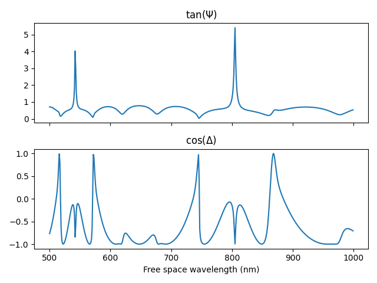

# Thin Film Interference

## Features

* Ellipsometry parameters psi and delta
* Arbitrary number of layers
* All-numpy implementation



## Installation

```sh
pip3 install thin_film_interference-0.0.1-py3-none-any.whl
```

## Usage

Interface:
```py
def ellipsometry(free_space_wavelengths: list | np.array,
    illumination_angle: float,
    refractive_indexes: list | np.array,
    film_thicknesses: list | np.array) -> (psi, delta)
```

Example function call:
```py
from thin_film_interference.ellipsometer import ellipsometry
import numpy as np

cover_refractive_index = 1.0
substrate_refractive_index = 3.8
refractive_indices = [cover_refractive_index, 3.8, 1.45, substrate_refractive_index]
film_thicknesses = [220, 3000]
incident_angle = np.deg2rad(65)
free_space_wavelength = np.arange(500, 1000)

psi, delta = ellipsometry(
    free_space_wavelength,
    incident_angle,
    refractive_indices,
    film_thicknesses,
)

```

## Testing

Benchmarked against [regress-pro](https://github.com/franko/regress-pro) and [Filmetrics](https://www.filmetrics.com/reflectance-calculator?wmin=200&wmax=1000&wstep=1&angle=0&pol=s&units=nm&mat%5B%5D=Air&d%5B%5D=0&mat%5B%5D=1.5&d%5B%5D=250&mat%5B%5D=Si&d%5B%5D=0&sptype=r).

## Contributing

Contributions and conversations warmly welcome.