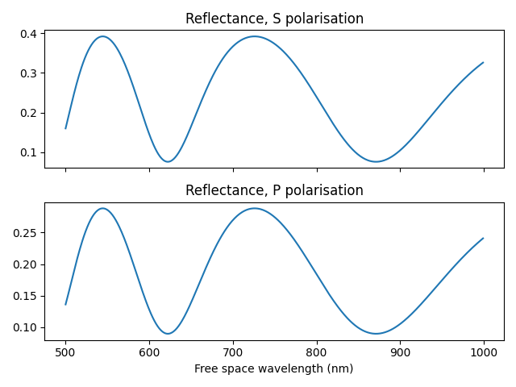
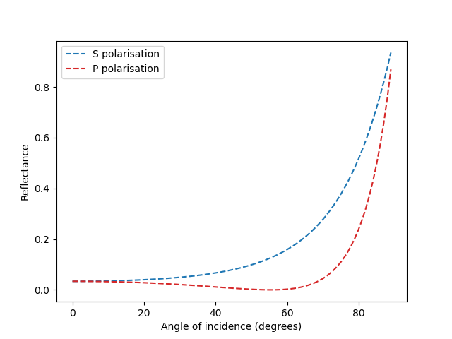

# Thin Film Interference

This collection of python functions models interference in thin films using simple analytical functions. The functions are ultimately applied to calculating the ellipsometry parameters psi and delta, as well as the Fabry Perot reflections from an n-layer thin film stack.

## Examples

* `psi_delta`: Psi and Delta are parameters used in [ellipsometry](https://en.wikipedia.org/wiki/Ellipsometry) to calculate the thickness and refractive index of thin films. This example calculates and plots psi and delta for a non-dispersive silicon-on-insulator thin film stack.

* `fabryperot`: A [Fabry-Pérot](https://en.wikipedia.org/wiki/Fabry–Pérot_interferometer) cavity supports a resonance due to multiple-beam interference between two interfaces. This example calculates the reflection spectra from a Fabry-Pérot thin-film cavity for s and p polarisations.

* `brewsters`: [Brewster's angle](https://en.wikipedia.org/wiki/Brewster's_angle) is the angle at which light of a particular polarisation is perfectly transmitted through a transparent dielectric surface. This example plots reflection and transmission of s and p polarised light in air incident on a glass surface.

