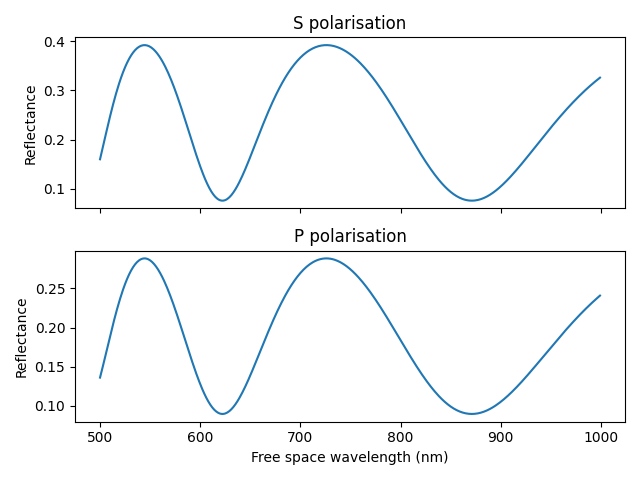

# Thin Film Interference

This collection of python functions models interference in thin films using simple analytical functions and a recursive algorithm. The functions are applied to calculating the ellipsometry parameters psi and delta and Fabry Perot reflections from an n-layer thin film stack.

## Examples

* `psi_delta`: Psi and Delta are parameters used in [ellipsometry](https://en.wikipedia.org/wiki/Ellipsometry) to calculate the thickness and refractive index of thin films. This example calculates and plots psi and delta for a non-dispersive silicon-on-insulator thin film stack.

* `fabryperot_multi`: A [Fabry-Pérot](https://en.wikipedia.org/wiki/Fabry–Pérot_interferometer) cavity from the same thin silicon and insulator layers as the psi_delta example. This example demonstrates the simplicity of calculating s and p polarised reflections from a multi-film stack.

* `fabryperot_single`: A Fabry-Pérot cavity from a single thin silica layer. This example calculates the reflection spectra from the cavity for s and p polarisations and exposes some of the more fundamental functions used in psi_delta and fabryperot_multi.

* `brewsters`: [Brewster's angle](https://en.wikipedia.org/wiki/Brewster's_angle) is the angle at which light of a particular polarisation is perfectly transmitted through a transparent dielectric surface. This example plots reflection and transmission of s and p polarised light in air incident on a glass surface.

